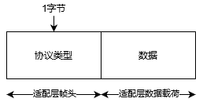
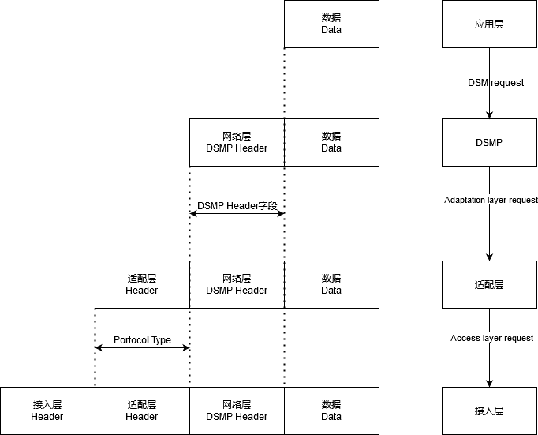

# C-V2X 网络层及适配层数据

## 适配层

适配层提供底层接入技术与上层协议栈之间的传输适配功能。其中，适配层接收上层发送的DSMP 数据包、IP 数据包或DME 数据包，区分待发送数据包所使用的底层接入技术，并将相应数据包递交到符合对应接入技术的底层进行传输；或接收来自底层的数据包，区分相应数据包所属的上层协议类型，并将数据包递交给指定的上层协议栈。

合作式智能运输系统专用短程通信网络层业务需支持无连接无确认的LLC 操作、子网接入协议和IP 数据报传输协议。

适配层帧格式如下图所示，适配层帧包含适配层帧头以及适配层有效载荷两部分。适配层有效载荷用于封装上层数据包。适配层帧格式中的比特顺序为高位在前（大端模式）。

其中协议类型，用于指示上层数据包所使用的协议类型，目前所用的为DSMP协议，即“04”，具体见下表:

| 取值  | 协议类型（Protocol Type） |
| ----- | ------------------------- |
| 0     | IPV6                      |
| 1     | 保留                      |
| 2     | 保留                      |
| 3     | 保留                      |
| 4     | DSMP协议                  |
| 5     | IPV4                      |
| 6~255 | 保留                      |

## 网络层

DSMP协议即专用短程通信短消息协议，关于DSM消息的逐层定义如下图所示：

DSM 的数据帧格式见下表。DSM 数据帧格式中的比特顺序为高位在前（大端模式）

| 字段一             | 字段二                | 字段三   | 字段四    | 字段五   | 字段六         | 字段七 |
| ------------------ | --------------------- | -------- | --------- | -------- | -------------- | ------ |
| 3             bits | 1bit                  | 4bits    | Var       | Var      | 2octets/16bits | var    |
| DSMP Version       | DSMP Option Indicator | Reserved | Extension | AID      | Length         | Data   |
| DSMP 版本          | DSMP 可选域指示       | 预留     | 扩展域    | 应用标识 | 数据长度       | 数据   |

Note:

> DSMP 版本（Version），区分不同的DSMP 版本号（0～7）。本标准中DSMP 版本取值为0。

> DSMP 可选域指示（DSMP Option Indicator），取值为1 表示后面的扩展域出现，取值为0 表示后面的扩展域不出现。

> 预留域（Reserved），预留比特，此版本全部取0。

> 扩展域（Extension），预留可用于其它信息，包含其它信息标识、其它信息长度和其它信息内容三部分，其它信息标识就是Element ID，具体见5.2.3.3 节。扩展域长度、内容等信息将与标准版本相关联。

> 应用标识（Application ID，AID），应用服务商的应用标识，区分不同的应用。

> 数据长度（Length），表示应用层数据实体的字节长度。

> 数据（Data），是承载的应用层或管理子层数据实体。

其中字段一至四填0x00即可，字段五AID应用标识用于区分不同的应用.

| 应用标识取值（ 十进制） | 应用标识取值（ p-encoding的十六进制） | 字节长度 | 应用领域或其他描述                     | 消息      | 映射的目标层二标识（十六进制） |
| ----------------------- | ------------------------------------- | -------- | -------------------------------------- | --------- | ------------------------------ |
| 111                     | 0p6F                                  | 1        | 车车基本安全应用-普通车辆状态          | BSM，常规 | 0x000001                       |
| 112                     | 0p70                                  | 1        | 车车基本安全应用-普通 车辆关键事件提醒 | BSM，事件 | 0x000002                       |
| 113                     | 0p71                                  | 1        | 车车基本安全应用-紧急车辆状态          | BSM，常规 | 0x000003                       |
| 114                     | 0p72                                  | 1        | 车车基本安全应用-紧急 车辆关键事件提醒 | BSM，事件 | 0x000004                       |
| 3618                    | 0p8D-A2                               | 2        | 地图类应用                             | MAP       | 0x000006                       |
| 3619                    | 0p8D-A3                               | 2        | 信号灯类应用                           | SPAT      | 0x000007                       |
| 3620                    | 0p8D-A4                               | 2        | 道路信息-静态类应用                    | RSI       | 0x000008                       |
| 3621                    | 0p8D-A5                               | 2        | 道路信息-半静态类应用                  | RSI       | 0x000009                       |
| 3622                    | 0p8D-A6                               | 2        | 道路信息-动态类应用                    | RSI       | 0x00000A                       |
| 3623                    | 0p8D-A7                               | 2        | 道路提醒类应用                         | RSM       | 0x00000B                       |
| 3627                    | 0p8D-AB                               | 2        | 证书管理                               |           | N/A                            |
| 3628                    | 0p8D-AC                               | 2        | 证书撤销列表                           |           | N/A                            |
| 3629                    | 0p8D-AD                               | 2        | 异常行为管理                           |           | N/A                            |

详见 [2020C-V2X“新四跨”暨大规模先导应用示范活动-接入层和AID配置文件.pdf](attachments/2020C-V2X“新四跨”暨大规模先导应用示范活动-接入层和AID配置文件.pdf)

## 参考

[C-V2X 网络层及适配层解析填充](https://blog.csdn.net/qq_35308053/article/details/115091699)